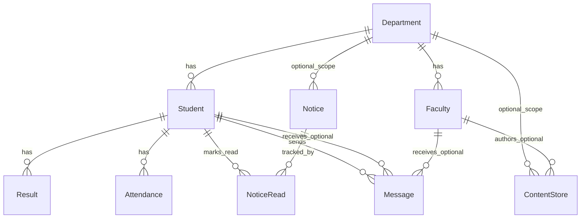

# College Management System — Architecture Guide

This document explains **models**, **relationships**, **URLs**, **views logic**, **how data is created/updated**, and **which frontend pages** connect to what. Use it as a map when reading or extending the project.

---

## 1. Big picture

```
Browser
   │
   ▼
core/urls.py  ──►  /admin/  → Django Admin (staff)
   │               /        → cms/urls.py (student + faculty portal)
   ▼
cms/views.py  ──►  queries models, sets session, renders templates
   ▼
cms/templates/*.html  ──►  extends index.html (base layout + nav)
   ▼
static/css/style.css  ──►  Blue Eclipse theme
   ▼
db.sqlite3  ──►  all cms.models tables
```

**Two separate login systems:**

| Who | Session key | Login URL | Redirect after login | Password storage |
|-----|-------------|-----------|---------------------|------------------|
| Student | `request.session['student_id']` | `/login/` | `/` (dashboard) | `Student.password` (hashed) |
| Faculty | `request.session['faculty_id']` | `/faculty/login/` | `/faculty/dashboard/` | `Faculty.password` (hashed) |
| Staff (Django) | Django auth session | `/admin/` | `/admin/` | `auth_user` table (built-in) |

Students and faculty do **not** use Django’s `User` model for the portal—only the admin site does.

**Admin Panel Customization:**
- Powered by `django-unfold` to replace the default Django admin stylesheet with Tailwind CSS.
- Customized color scheme config in `settings.py` using colors matching the **Blue Eclipse** theme (Void Blue primary `#0D1B2A`, Slate neutral scale).

---

## 2. Model relationship diagram



---

## 3. Models — fields and meaning

### `Department`
| Field | Type | Notes |
|-------|------|--------|
| `name` | CharField | e.g. Computer Science |

**Connected to:** `Student`, `Faculty`, `Notice`, `ContentStore` (all via ForeignKey).

---

### `Student`
| Field | Type | Notes |
|-------|------|--------|
| `name` | CharField | Full name |
| `DOB` | DateField | Date of birth |
| `roll_no` | CharField, unique | **Login username** for student portal |
| `department` | FK → Department | Required |
| `semester` | CharField, optional | Used to filter notices & content |
| `password` | CharField | Hashed with `make_password()` |

**Reverse relations (use in code):**
- `student.results`
- `student.attendance_records`
- `student.notice_reads`
- `student.sent_messages`
- `student.received_messages` (when another student messages them)

---

### `Result`
| Field | Type | Notes |
|-------|------|--------|
| `student` | FK → Student | `related_name='results'` |
| `semester` | CharField | e.g. `"2"` |
| `course` | CharField | Course name |
| `grade` | CharField | e.g. A, B+ |
| `created_at` | DateTime | Auto on create |

**One student → many results.** Read-only on the student website; staff adds via admin.

---

### `Attendance`
| Field | Type | Notes |
|-------|------|--------|
| `student` | FK → Student | `related_name='attendance_records'` |
| `date` | DateField | One row per student per day (unique constraint) |
| `subject` | CharField, optional | e.g. DSA |
| `status` | CharField | `present`, `absent`, `late`, `excused` |
| `created_at` | DateTime | Auto |

**Property:** `counts_as_present` — present, late, and excused count toward attendance %.

---

### `Notice`
| Field | Type | Notes |
|-------|------|--------|
| `title` | CharField | Short heading |
| `message` | TextField | Full text |
| `department` | FK → Department, **null = all departments** | Scoped targeting |
| `semester` | CharField, **blank = all semesters** | Scoped targeting |
| `created_at` | DateTime | Auto |

**Visibility rule** (in `_notice_queryset_for_student`):

```text
Show notice IF:
  (department is NULL OR department = student's department)
  AND
  (semester is '' OR semester = student's semester)
```

---

### `NoticeRead`
| Field | Type | Notes |
|-------|------|--------|
| `student` | FK → Student | |
| `notice` | FK → Notice | `related_name='reads'` |
| `read_at` | DateTime | Auto |

**Purpose:** Unread badge on nav. When student opens `/notices/`, rows are bulk-created here. Unique per (student, notice).

---

### `Faculty`
| Field | Type | Notes |
|-------|------|--------|
| `employee_id` | CharField, unique | **Login username** for faculty portal |
| `name` | CharField | |
| `email` | EmailField | Shown in directory / contact |
| `phone` | CharField, optional | |
| `designation` | CharField | e.g. Professor |
| `department` | FK → Department | `related_name='faculty'` |
| `password` | CharField | Hashed |
| `is_active` | Boolean | Inactive faculty cannot log in |

---

### `ContentStore`
| Field | Type | Notes |
|-------|------|--------|
| `title` | CharField | |
| `description` | TextField, optional | Short summary |
| `content_type` | CharField | `notes`, `syllabus`, `resource`, `announcement` |
| `body` | TextField, optional | Main text on page |
| `external_url` | URLField, optional | Link button if set |
| `department` | FK, null = all depts | Filter scope |
| `faculty` | FK, null allowed | Who uploaded (optional) |
| `semester` | CharField, blank = all | Filter scope |
| `created_at` | DateTime | Auto |

**Visibility** (in `_content_for_student`): same idea as notices—department + semester must match student or be empty/global.

---

### `Message`
| Field | Type | Notes |
|-------|------|--------|
| `sender` | FK → Student | Always the logged-in student |
| `recipient_type` | CharField | `faculty`, `student`, or `admin` |
| `faculty` | FK, optional | Set when messaging a faculty member |
| `recipient_student` | FK → Student, optional | Set when messaging another student |
| `subject` | CharField | |
| `body` | TextField | |
| `is_read` | Boolean | Faculty marks read in inbox; admin can see in admin |
| `created_at` | DateTime | Auto |

**Recipient rules:**

| `recipient_type` | `faculty` | `recipient_student` | Who sees it |
|------------------|-----------|---------------------|-------------|
| `faculty` | Required | null | That faculty’s inbox |
| `student` | null | Required | Peer (no student inbox UI yet—only sender history) |
| `admin` | null | null | Django admin → Messages |

---

### `Timetable`
| Field | Type | Notes |
|-------|------|--------|
| `department` | FK → Department | Department class belongs to |
| `semester` | CharField | Semester value e.g. "2" |
| `day_of_week` | CharField | Day choice: Monday-Sunday |
| `subject` | CharField | Subject name |
| `start_time` | TimeField | Lecture start time |
| `end_time` | TimeField | Lecture end time |
| `faculty` | FK → Faculty, optional | Faculty teaching class |
| `classroom` | CharField, optional | Classroom name or ID |
| `is_essential` | BooleanField | Flag to highlight essential classes |

---

## 4. URL → View → Template map

All app routes live in `cms/urls.py`. Names are used in templates as ``.

| URL path | URL name | View function | Template | Auth |
|----------|----------|---------------|----------|------|
| `/` | `index` | `index` | `index.html` (dashboard block) | Student |
| `/login/` | `login` | `login_view` | `login.html` | Public |
| `/logout/` | `logout` | `logout_view` | redirect → login | Student |
| `/add/` | `addstudent` | `addstudent` | `add.html` | Public |
| `/students/` | `students` | `students` | `list.html` | Student |
| `/faculty/` | `faculty_list` | `faculty_list` | `faculty_list.html` | Student |
| `/content/` | `content_list` | `content_list` | `content_list.html` | Student |
| `/contact/` | `contact` | `contact_view` | `contact.html` | Student |
| `/messages/compose/` | `message_compose` | `message_compose` | `message_compose.html` | Student |
| `/messages/sent/` | `my_messages` | `my_messages` | `my_messages.html` | Student |
| `/profile/edit/` | `edit_profile` | `edit_profile` | `edit_profile.html` | Student |
| `/results/` | `results` | `results_view` | `results.html` | Student |
| `/attendance/` | `attendance` | `attendance_view` | `attendance.html` | Student |
| `/timetable/` | `timetable` | `timetable_view` | `timetable.html` | Student |
| `/notices/` | `notices` | `notices_view` | `notices.html` | Student |
| `/faculty/login/` | `faculty_login` | `faculty_login_view` | `faculty_login.html` | Public |
| `/faculty/logout/` | `faculty_logout` | `faculty_logout_view` | redirect | Faculty |
| `/faculty/dashboard/` | `faculty_dashboard` | `faculty_dashboard` | `faculty_dashboard.html` | Faculty |
| `/faculty/inbox/` | `faculty_inbox` | `faculty_inbox` | `faculty_inbox.html` | Faculty |
| `/faculty/attendance/` | `faculty_attendance` | `faculty_attendance` | `faculty_attendance.html` | Faculty |
| `/faculty/results/` | `faculty_results` | `faculty_results` | `faculty_results.html` | Faculty |
| `/faculty/profile/edit/` | `faculty_edit_profile` | `faculty_edit_profile` | `faculty_edit_profile.html` | Faculty |
| `/admin/` | — | Django admin | built-in | Staff User |

**Project root routing:** `core/urls.py` includes `cms.urls` at `""` and mounts admin at `admin/`.

---

## 5. View logic (what each view does)

### Helpers (`cms/views.py`)

| Function | Purpose |
|----------|---------|
| `_get_logged_in_student` | Load student from `session['student_id']` or flush session |
| `_get_logged_in_faculty` | Load faculty from `session['faculty_id']` |
| `_attendance_stats` | Count total / present % for dashboard |
| `_notice_queryset_for_student` | Filter notices by dept + semester |
| `_content_for_student` | Filter content store by dept + semester |
| `_apply_department_filter` | `?department=<id>` on list pages |
| `@student_login_required` | Redirect to `/login/` if no student session |
| `@faculty_login_required` | Redirect to `/faculty/login/` if no faculty session |

### Context processor (`cms/context_processors.py`)

Runs on **every** template render:

- If student logged in → provides `unread_notice_count` for nav badge on all pages extending `index.html`.

Registered in `core/settings.py` → `TEMPLATES` → `context_processors`.

---

### Per-view behavior

#### `index` (dashboard)
- **Reads:** student, peer count, attendance stats, notices (latest 3 + unread count), faculty count in dept.
- **Writes:** nothing.
- **Template:** `index.html` default ``.

#### `login_view` / `logout_view`
- **POST login:** `roll_no` + password → `check_password` → set `session['student_id']`.
- **Logout:** `session.flush()`.

#### `addstudent`
- **GET:** registration form with department dropdown.
- **POST:** creates `Student` with hashed password; redirects to login.
- **Validation:** department required, unique `roll_no`.

#### `edit_profile`
- **POST:** updates name, DOB, semester; optional new password (hashed).
- **Does not change:** roll_no, department (read-only in form).

#### `students`
- **GET `?department=`:** filters student list.
- **Template:** link to `message_compose?type=student&student=<id>`.

#### `faculty_list`
- **GET `?department=`:** defaults to **logged-in student’s department** if not passed.
- Lists active faculty; **Send Message** → compose with `type=faculty&faculty=<id>`.

#### `contact_view`
- **GET `?department=` + `?tab=faculty|students`:** two directories, message links.

#### `message_compose`
- **GET params:** `type`, `faculty`, `student` pre-select recipient.
- **POST:** creates one `Message` row.
- **Success:** shows confirmation (no redirect).

#### `my_messages`
- Lists `Message.objects.filter(sender=current_student)`.

#### `results_view` / `attendance_view` / `timetable_view`
- Read-only schedules and scores for **current student only**. `timetable_view` filters classes by student's department and semester.


#### `notices_view`
- Filters notices for student; **bulk creates** `NoticeRead` (marks all visible as read).

#### `content_list`
- **GET `?department=` + `?type=`:** filtered content for student scope.

#### `faculty_login_view` / `faculty_logout_view`
- Faculty login via `employee_id` + password → redirect to `faculty_dashboard`.
- Logout: pop `faculty_id` from session.

#### `faculty_dashboard`
- **Reads:** faculty profile, student count in dept, faculty colleague count, unread message count.
- **Writes:** nothing.
- **Template:** `faculty_dashboard.html` — profile card + metrics + quick-action buttons.

#### `faculty_inbox`
- Inbox: messages where `recipient_type=faculty` and `faculty=logged_in_faculty`.
- **POST:** mark single message `is_read=True`.

#### `faculty_attendance`
- **GET params:** `semester`, `date`, `subject` — loads students in faculty's department matching semester.
- Pre-fills radio buttons if attendance records already exist for that date.
- **POST:** creates or updates `Attendance` objects for each student. Reports counts of new/updated records.

#### `faculty_results`
- **GET params:** `semester`, `course` — loads students in faculty's department matching semester.
- Pre-fills grade dropdowns if `Result` objects already exist for that semester+course.
- **POST:** creates or updates `Result` objects. Grade choices: A+ through F.

#### `faculty_edit_profile`
- **POST:** updates name, email, phone; optional new password (hashed).
- **Does not change:** employee_id, department, designation (read-only in form).

---

## 6. How data is added or updated (by feature)

### Legend
- **Frontend form** = user fills HTML form in portal
- **Admin** = Django admin at `/admin/`
- **Seed/script** = manual DB seed (see `CREDENTIALS.md`)

| Data | Created by | Updated by | Student can edit? | Faculty can edit? |
|------|------------|------------|-------------------|-------------------|
| Department | Admin / seed | Admin | No | No |
| Student | `/add/` form, Admin | `/profile/edit/`, Admin | Partial (profile only) | No |
| Result | Admin, Faculty `/faculty/results/` | Admin, Faculty `/faculty/results/` | No (view only) | Yes (own dept) |
| Attendance | Admin, Faculty `/faculty/attendance/` | Admin, Faculty `/faculty/attendance/` | No (view only) | Yes (own dept) |
| Notice | Admin | Admin | No (view; marks read on open) | No |
| NoticeRead | Auto when opening `/notices/` | — | Auto | — |
| Faculty | Admin | Admin, Faculty `/faculty/profile/edit/` | No (view directory) | Partial (profile only) |
| ContentStore | Admin | Admin | No (view only) | No |
| Message | Student `/messages/compose/` | Faculty marks read; Admin views | Send only | Mark read |

### Typical admin workflow
1. Open http://127.0.0.1:8000/admin/
2. Log in as `admin`
3. Add **Department** first (if new)
4. Add **Student** / **Faculty** (set passwords in admin—hash manually or use same hasher in shell)
5. Add **Results**, **Attendance**, **Notices**, **Content store**
6. View **Messages** (students cannot create messages from admin—`has_add_permission = False`)

> **Important:** When creating students/faculty in admin, passwords must be **hashed** (`make_password('text')`) or they will not work on login forms. Registration form `/add/` hashes automatically.

---

## 7. Frontend structure

### Base template: `index.html`
- Navbar with `` links
- `` for page body
- Loads `static/css/style.css`
- Shows notice badge if `unread_notice_count` (from view or context processor)

### Child templates (all ``)
| Template | Extends | Main purpose |
|----------|---------|----------------|
| `login.html` | index | Student login |
| `add.html` | index | Register student |
| `edit_profile.html` | index | Edit student profile |
| `list.html` | index | Student directory + dept filter |
| `faculty_list.html` | index | Faculty table + message links |
| `contact.html` | index | Tabs: faculty / students |
| `message_compose.html` | index | Send message form |
| `my_messages.html` | index | Sent messages table |
| `content_list.html` | index | Content cards + filters |
| `results.html` | index | Grades table |
| `attendance.html` | index | Attendance table + summary |
| `notices.html` | index | Full notice list |
| `faculty_login.html` | index | Faculty login |
| `faculty_dashboard.html` | index | Faculty dashboard + profile + metrics |
| `faculty_inbox.html` | index | Faculty messages |
| `faculty_attendance.html` | index | Mark attendance for students |
| `faculty_results.html` | index | Add/update student results |
| `faculty_edit_profile.html` | index | Edit faculty profile |

### Linking pattern (examples)
```html
<a href="">Faculty</a>
<a href="?type=faculty&faculty={{ f.id }}">Send Message</a>
<a href="?tab=students&department={{ dept.id }}">Contact</a>
```

Forms use **POST + ``** to the same URL as the view.

---

## 8. Request flow examples

### Student logs in
```
GET /login/  → login.html
POST /login/ → check_password → session['student_id']=id → redirect GET /
GET /        → index view → dashboard context → index.html
```

### Student sends message to faculty
```
GET /faculty/ → pick faculty → link to
GET /messages/compose/?type=faculty&faculty=3 → message_compose.html
POST /messages/compose/ → Message.objects.create(...) → success message on same page
```

### Student opens notices (unread → read)
```
GET /notices/ → filter notices → render list
            → NoticeRead.bulk_create(...) for each notice
            → unread count on nav drops to 0 on next page
```

### Faculty reads inbox
```
GET /faculty/login/ → POST → session['faculty_id'] → redirect /faculty/dashboard/
GET /faculty/inbox/ → Message filtered by faculty
POST (mark read)    → Message.is_read=True → redirect inbox
```

### Faculty marks attendance
```
GET /faculty/attendance/?semester=2&date=2026-06-07&subject=DSA
    → loads students in dept with semester=2
    → pre-fills status radios from existing Attendance records
POST /faculty/attendance/
    → creates or updates Attendance rows → success message on same page
```

### Faculty adds results
```
GET /faculty/results/?semester=2&course=Data+Structures
    → loads students in dept with semester=2
    → pre-fills grade dropdowns from existing Result records
POST /faculty/results/
    → creates or updates Result rows → success message on same page
```

---

## 9. File layout (what to open when debugging)

```
college_System/
├── core/
│   ├── settings.py      # INSTALLED_APPS, DB, static, context_processors
│   └── urls.py          # admin + include cms.urls
├── cms/
│   ├── models.py        # All database tables
│   ├── views.py         # All page logic
│   ├── urls.py          # URL → view mapping
│   ├── admin.py         # Admin panels
│   ├── context_processors.py  # Nav unread notices
│   ├── migrations/      # DB schema history
│   └── templates/     # HTML pages
├── static/css/style.css # UI theme
├── db.sqlite3           # Database file
├── CREDENTIALS.md       # Logins & test users
└── ARCHITECTURE.md      # This file
```

---

## 10. Database migrations

When you change `models.py`:

```powershell
python manage.py makemigrations cms
python manage.py migrate
```

Migration files are in `cms/migrations/` (e.g. `0006_faculty_contentstore_message.py`).

---

## 11. Filtering cheat sheet

| Page | Query param | Effect |
|------|-------------|--------|
| `/students/` | `department=<id>` | Filter students by department |
| `/faculty/` | `department=<id>` | Filter faculty (default: your dept) |
| `/contact/` | `department=<id>`, `tab=faculty\|students` | Directory filters + tab |
| `/content/` | `department=<id>`, `type=notes\|...` | Narrow content list |

Notices and content also apply **automatic** semester/dept rules based on logged-in student (no extra param needed).

---

## 12. Extending the project (common next steps)

| Goal | Where to change |
|------|-----------------|
| New page | Add view in `views.py`, path in `urls.py`, template in `templates/` |
| New DB table | Add model → migrate → register in `admin.py` |
| Student-only menu link | `index.html` nav block |
| New filter on a list | View: read `request.GET`, filter queryset; template: `<select name="department">` |
| Peer message inbox | New view + template filtering `Message` where `recipient_student=request student` |
| Faculty upload content | POST form on faculty portal writing to `ContentStore` |

---

## 13. Security notes (for production)

- Session keys (`student_id`, `faculty_id`) are simple—fine for learning; production may use Django auth or JWT.
- `DEBUG = True` and default `SECRET_KEY` in `settings.py` are not production-safe.
- Hash all passwords with `make_password` / `check_password` (already done on student register/login paths).
- Do not expose `CREDENTIALS.md` or `db.sqlite3` publicly.

---

*For login details and sample users, see `CREDENTIALS.md`.*
